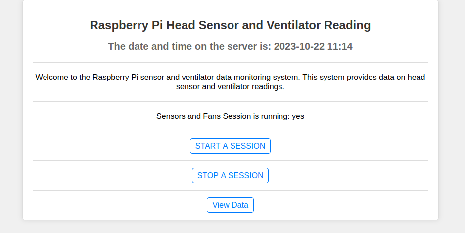
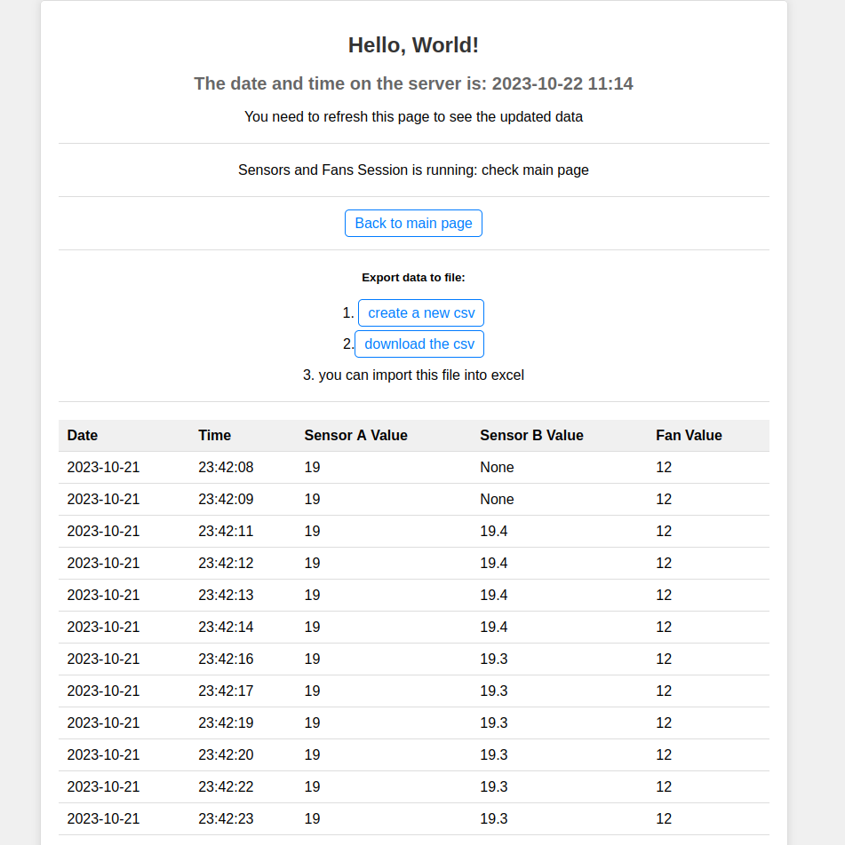
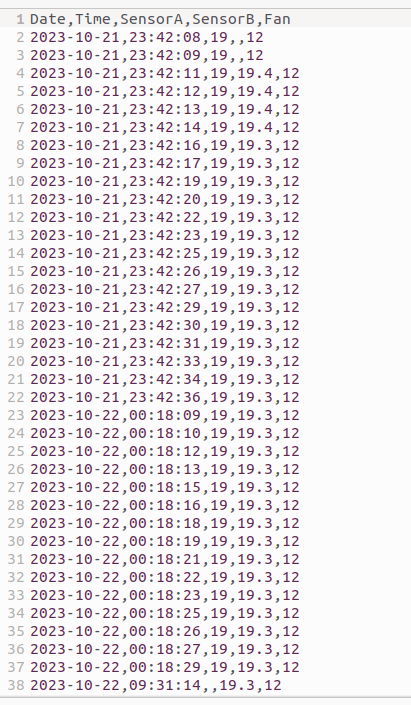

# G.R.IN.C.H
**G**PIO **R**aspberry **IN**terface for **C**limate and **H**eating

A simple project to set up a Raspberry Pi for reading temperature sensors and controlling a fan's speed. The sensor data is stored in a SQLite database, and the data is shown on a homepage in your local home network and the data can be exported as CSV. Everything is written in Python.

## Table of Contents
- [What this is able to do](#what-this-is-able-to-do)
- [What this is almost able to do](#what-this-is-almost-able-to-do)
- [What this is not able to do](#what-this-is-not-able-to-do)
- [What Is](#what-is)
- [Prerequisites You May Not Have](#prerequisites-you-may-not-have)
- [Read tutorials for each component](#read-tutorials-for-each-component)
- [How to Set Up Your Raspberry Pi](#how-to-set-up-your-raspberry-pi)
- [Connect to your Rasperry PI (via SSH)](#-connect-to-your-raspberry-pi-via-ssh)
- [Configure Your Raspberry Pi (via a terminal or SSH)](#configure-your-raspberry-pi)
- [Clone the Repository](#clone-the-repository)
- [Install the Database](#install-the-database)
- [Install Flask](#install-flask)
- [Install the Sensors Software](#install-the-sensors-software)
- [How to Start the Server](#how-to-start-the-server)
- [Read more about the actual code](#read-more-about-the-actual-code)
- [What does the local homepage look like](#what-does-the-local-homepage-look-like)
- [Things to Consider](#things-to-consider)
- [Troubleshooting](#troubleshooting)

## What this is able to do:
- read temperature from two DHT22 Sensors
- save the data to a local database
- show data on a local homepage
- start and stop recording data with buttons on a local homepage
- download your data as CSV file

## What this is almost able to do:
- controll a fan with PWM
- change fan speed depending on the temperature readings

## What this is not able to do:
- controll a heating element 
- controll a 12V PWM fan properly

## What Is:

### Raspberry Pi
A Raspberry Pi is a small computer running a Unix-based operating system (Raspbian OS). It has GPIO pins for connecting sensors and fans.

### Raspbian OS
The operating system installed on the Raspberry Pi. Similar to Windows or macOS on your PC, you'll need to install it on a new Raspberry Pi.

### Python3
Python is the programming language used for this project. It's responsible for tasks like reading sensors, controlling the fan, saving data in the database, and creating a web server to display data.

### SQLite3
SQLite is a lightweight SQL database used to store data in a structured format on your Raspberry Pi.

### Flask
Flask is a Python web server framework that simplifies the process of setting up a web server and creating a homepage.

## Prerequisites You May Not Have:
- Monitor, mouse, and keyboard for easy Raspberry Pi setup.
- Wi-Fi connectivity or a network cable to connect your Raspberry Pi to your local network.
- Knowledge of your Raspberry Pi's IP address to access it.
- Crosslink or regular network cable to connect your Raspberry Pi.

## Read tutorials for each component:
   - [Raspberry Pi Setup](https://www.tomshardware.com/reviews/raspberry-pi-headless-setup-how-to,6028.html)
   - [GPIO](https://towardsdatascience.com/python-webserver-with-flask-and-raspberry-pi-398423cc6f5d)
   - [Local Web Server](https://projects.raspberrypi.org/en/projects/python-web-server-with-flask/1)
   - [Database](https://www.pythonforthelab.com/blog/storing-data-with-sqlite/)
   - [DC Fans](https://www.digikey.com/en/maker/tutorials/2019/how-to-control-a-dc-fan-using-the-raspberry-pi)
   - [Sensors](https://tutorials-raspberrypi.de/raspberry-pi-luftfeuchtigkeit-temperatur-messen-dht11-dht22/)

## How to Set Up Your Raspberry Pi:
0. If you received a Raspberry Pi from your university, it may already have an OS installed. If so, skip to save time, but you might have to deal with previously installed software.

1. Install the Raspbian OS on an SD card (see step 2 before installing it). [Raspbian OS Download](https://www.raspberrypi.com/software/)

2. Configure your Raspberry Pi's network settings to connect to your local network.

3. Insert the SD card into your Raspberry Pi, connect it to power, and wait a few minutes.

   - If you're not familiar with SSH, connect a monitor, mouse, and keyboard to your Raspberry Pi; it's easier.

4. Connect to your Raspberry Pi via SSH (if you don't have a monitor, mouse, and keyboard available).

## Connect to your Rasperry PI (via SSH):
read [this](how-to-ssh.md) or just use a monitor

## Configure Your Raspberry Pi:
0. `sudo apt update`
1. Install Python3 if it's not already preinstalled.
2. Install SQLite3.

## Clone the Repository:
- `git clone https://github.com/EliasPh/GRINCH.git`
- `cd GRINCH`

## Install the Database:
1. `sudo apt-get install sqlite3`
   (You can ignore warnings about locale settings.)

2. Create your database using SQLite:
`sqlite3 sensordata.db`

`CREATE TABLE sensora(id INTEGER PRIMARY KEY AUTOINCREMENT, temperature NUMERIC, currentdate DATE, currenttime TIME, device TEXT);`

`CREATE TABLE sensorb(id INTEGER PRIMARY KEY AUTOINCREMENT, temperature NUMERIC, currentdate DATE, currenttime TIME, device TEXT);`

`CREATE TABLE fan(id INTEGER PRIMARY KEY AUTOINCREMENT, fanspeed NUMERIC, currentdate DATE, currenttime TIME, device TEXT);`

`.quit`

You will find the `sensordata.db` file in your current directory.

## Install Flask:
- `pip3 install flask`

## Install the Sensors Software - This is the most difficuilt part
Make sure to read carefully. Adafruit has some small testing scripts. Run those too to check if your sensors are working at all before working on this projects code.

- Make sure to follow the Adafruit CircuitPython installation instructions: [Adafruit CircuitPython Installation Guide](https://learn.adafruit.com/circuitpython-on-raspberrypi-linux/installing-circuitpython-on-raspberry-pi)

- `sudo python3 -m pip install --force-reinstall adafruit-blinka`
- `pip3 install adafruit-circuitpython-dht`
- Note that the libaries called Adafruit_DHT and/or Adafruit-DHT are no longer maintained and do not work.

You can not mix the Adarfruit Library with the vanilla Raspberry PI GPIO Library. 

## How to Start the Server:
- Run `python "path to where you cloned the repo/GRINCH/the-actual-code/webserver.py"`

## Read more about the actual code
The code is located in the "the-actual-code" directory. 
Read more about it [here](the-actual-code/the-actual-code.md)

## What does the local homepage look like:
### Landingpage

### A running Session

### The Data View

### An exported CSV

## Things to Consider:
- Check the voltage and amperage of your fan, as it may be different for 12V or 5V fans. Ensure that connecting a 12V fan directly to your Raspberry Pi won't damage it.

## Troubleshooting:
- If you downloaded an image file with a `.xy` extension, learn how to extract it [here](https://www.cyberciti.biz/faq/how-to-extract-tar-xz-files-in-linux-and-unzip-all-files/).
